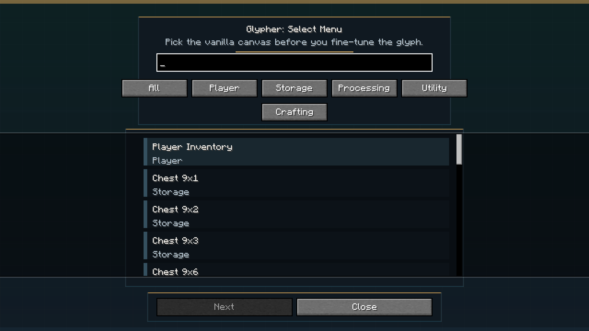
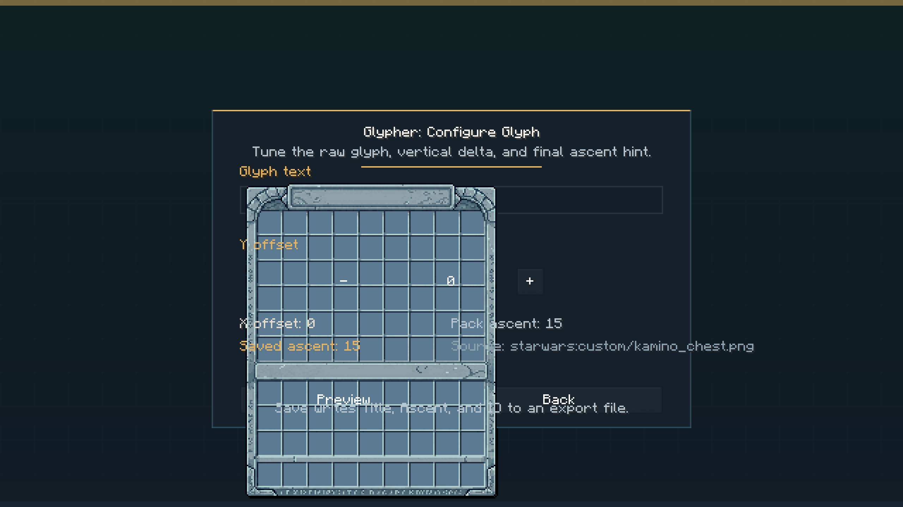
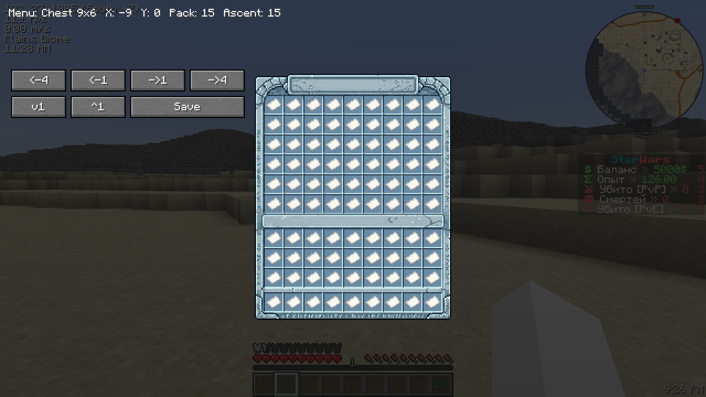
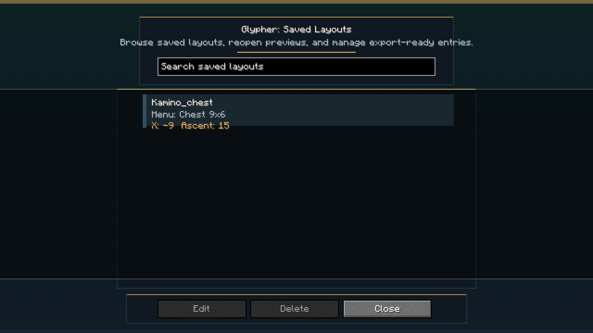

# Glypher

`Glypher` is a client-only Fabric mod for aligning custom title glyphs inside vanilla Minecraft GUI screens.

Authors: `LmVictor20 x ChatGPT`

## What Glypher does

Glypher helps you build GUI title layouts directly in-game:

- choose a vanilla menu type;
- enter the glyph character used as the title;
- preview the real vanilla screen;
- move the title horizontally with offset glyphs;
- move the title vertically with a virtual ascent preview;
- save the final result into an export file for your resource pack.

After saving, Glypher creates a text export file with:

- `ID`
- `Title`
- `Ascent`

## Supported version

- Minecraft `1.21.3`
- Fabric Loader
- Fabric API

## Installation

1. Put the Glypher mod jar into your `mods` folder.
2. Prepare and enable a resource pack with your custom GUI glyphs.
3. Make sure your resource pack contains `assets/minecraft/font/default.json`.
4. Start the game.
5. Use `/glypher create`.

## Where to place `default.json`

The file must be placed inside your resource pack here:

```text
<YourResourcePack>/assets/minecraft/font/default.json
```

If `default.json` already exists, do not blindly replace it.
Merge the `providers` from your current file with the Glypher example.

## Included example

This repository includes an example file here:

```text
resourcepack-example/assets/minecraft/font/default.json
```

You can use it as a base template for your own pack.

## How to prepare the resource pack

Minimal structure:

```text
MyPack/
  pack.mcmeta
  assets/
    minecraft/
      font/
        default.json
    mynamespace/
      textures/
        gui/
          my_menu_title.png
          my_small_menu_title.png
          my_beacon_title.png
```

Important notes:

- custom title images are usually added with a `"type": "bitmap"` provider;
- horizontal movement is done with a `"type": "space"` provider;
- the `Ascent` exported by Glypher should be copied into the `"ascent"` value of the matching bitmap provider;
- if you already have a working `default.json`, you usually only need to add the missing bitmap providers and the offset glyph `space` provider.

## Example `default.json`

The included example contains:

- several bitmap providers for GUI title images;
- one `space` provider with offset glyphs used by Glypher.

The `space` block uses the same offset glyphs expected by the mod:

- `\uF800` to `\uF80A` for positive horizontal movement;
- `\uF80B` to `\uF815` for negative horizontal movement.

Example:

```json
{
  "type": "bitmap",
  "file": "mynamespace:gui/my_menu_title.png",
  "ascent": 24,
  "height": 256,
  "chars": [
    "\uE120"
  ]
}
```

## How Glypher works step by step

1. Run `/glypher create`.
2. Select the vanilla menu type you want to edit.
3. Enter the glyph character used as the menu title.
4. Open the preview screen.
5. Adjust the title on the `X` axis.
6. Adjust the title on the `Y` axis.
7. Visually align the title until it looks correct.
8. Press `Save`.
9. Enter a layout ID.
10. Open the generated export file.
11. Copy the exported `Title` and `Ascent` into your resource pack setup.

## Commands

- `/glypher create` - create a new layout
- `/glypher list` - open the saved layouts screen

## Saved data

Glypher stores:

- layout data in `config/glypher/layouts.json`
- exported text files in `config/glypher/exports/`

## Understanding `X` offset

Glypher does not move the title by raw screen coordinates.
Instead, it builds the final title text like this:

```text
<offset glyphs> + <your title glyph>
```

That means special shift glyphs are inserted before the main glyph to move the title left or right.

## Understanding `Y` offset

Glypher previews vertical movement in-game as a virtual offset.
When you save the layout, Glypher gives you a recommended `Ascent` value.

That value should be placed into the bitmap provider for the glyph in `default.json`.

Example:

```json
{
  "type": "bitmap",
  "file": "mynamespace:gui/my_menu_title.png",
  "ascent": 24,
  "height": 256,
  "chars": ["\uE120"]
}
```

## Typical workflow

1. Draw your GUI title image.
2. Bind it to a glyph in `default.json`.
3. Start the game with the resource pack enabled.
4. Run `/glypher create`.
5. Choose a menu type.
6. Enter the title glyph.
7. Align the title in the preview.
8. Save the layout.
9. Copy the exported values into your final resource pack configuration.

## Screenshot placeholders

### Menu Selection



### Glyph Input



### Preview Screen



### Saved Layouts



## Credits

`LmVictor20 x ChatGPT`
